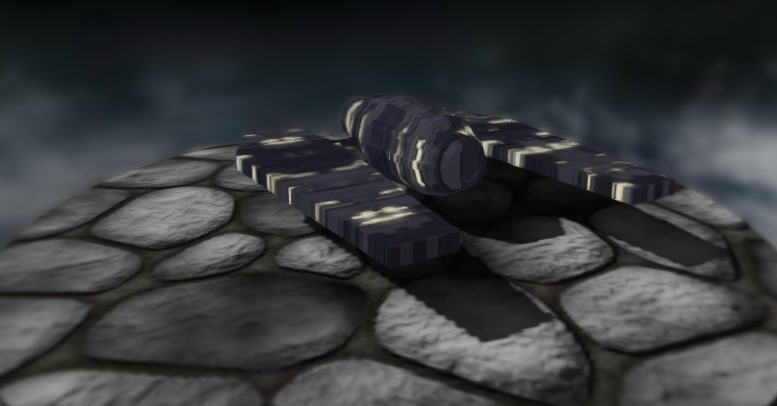

# KernEngine


> The GL in OpenGL stands for "Good Luck" because you are going to need it.

KernEngine is a Game Engine/Framework for realtime 3d rendering and game development.
Extracted from 2 projects for university courses.

## Requirements

Development is done with
* Conan 2.x
* CMake 3.27.x
* Visual Studio 2022 Community Edition

## Building

Conan install for debug and release build types
```
conan install . --build=missing --settings=build_type=Debug && conan install . --build=missing --settings=build_type=Release
```

CMake project generation
```
cmake --preset conan-default
```

Build in release mode
```
cd build
cmake --build . --config Release
```

## Literature

Relevant tutorials
* https://learnopengl.com
* http://www.opengl-tutorial.org
* https://open.gl
* https://ogldev.org/
* https://www.spieleprogrammierung.net/p/opengl-tutorial-liste.html
* https://www.tomdalling.com/blog/category/modern-opengl
* http://lazyfoo.net/tutorials/OpenGL
* https://antongerdelan.net/opengl
* http://www.mbsoftworks.sk/tutorials
* http://duriansoftware.com/joe/An-intro-to-modern-OpenGL.-Table-of-Contents.html
* https://www.rastertek.com/tutdx11s2ter.html - Actually DirectX11 but the terrain tutorial looks interesting
* https://github.com/fendevel/Guide-to-Modern-OpenGL-Functions
* https://www.swiftless.com/
* https://www.khronos.org/opengl/wiki/Getting_Started - List of other tutorials
* https://github.com/fendevel/Guide-to-Modern-OpenGL-Functions

## Screenshots


